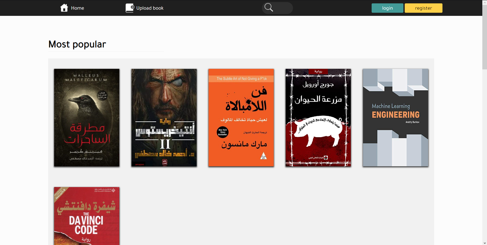

# Book Shop 
Book shop is a website built using ASP.CORE framework. The site allow the user to read or upload books.  allow the Author of this bokk to delete it.

## how to use
The project must run in Visual studio c to run correctly. installing ASP.CORE in the editor. After that you can run it normally in your browser.

## Home-Page

## Authentication
The project provides book access to anyone. But if you want to upload or to manipulate your books it had to login on the site. The page 

