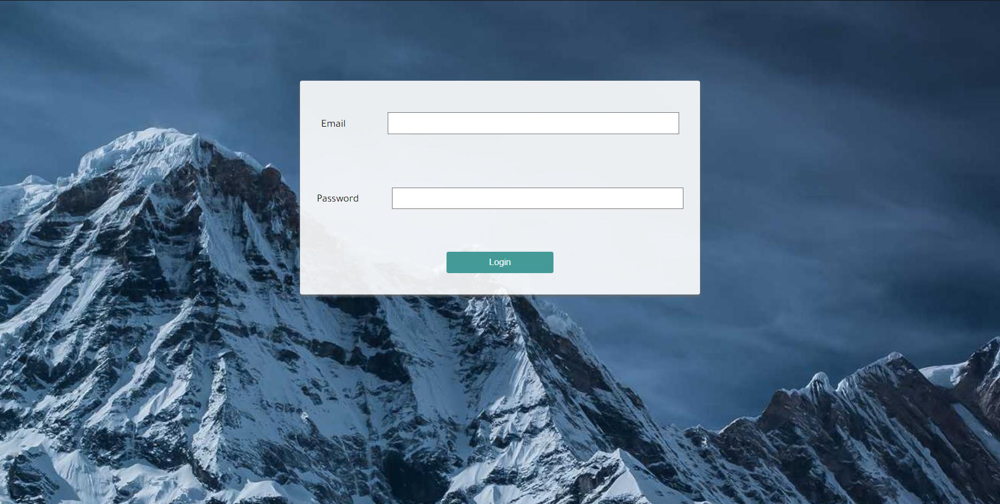

# Book Shop 
The bookshop is a website built using ASP. CORE framework. The site allows the user to read or upload books. Also, it has allowed the Author  to delete its books.

## how to use
The project must run in Visual studio c to run correctly. installing ASP.CORE in the editor. After that you can run it normally in your browser.

## What services that the system provides ?
### Home Page
it accesable to everyone. no need to authentication

### Authentication
The project provides book access to anyone. But if you want to upload or to manipulate your books it had to login on the site. Authentication page as shown below

### Uploading books

### Searching 

### Preview books

